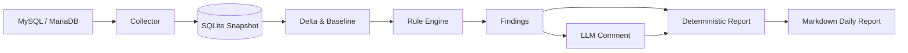

# DBInsight

**MySQL/MariaDB 상태 데이터를 수집·분석해 DBA가 먼저 확인해야 할 변화와 이상 징후를 Daily Report로 정리하는 경량 모니터링 프로젝트입니다.**

DBInsight는 단순히 Performance Schema 원본을 LLM에 전달하지 않습니다. DB 상태 데이터를 Snapshot으로 저장하고, Counter Delta·Baseline·Rule Engine으로 먼저 분석한 뒤, LLM은 이미 계산된 근거를 사람이 읽기 좋은 코멘트로 정리하는 역할만 담당합니다.

## Why DBInsight?

DBA가 매일 여러 화면과 SQL을 직접 확인하면 다음 질문에 답하는 데 시간이 듭니다.

- 오늘 평소와 달라진 지표가 있는가?
- 새롭게 느려진 SQL이 있는가?
- Connection / Lock / Transaction 상태에 위험 신호가 있는가?
- 어제 발생했던 Warning이 계속되고 있는가?
- 지금 가장 먼저 무엇을 확인해야 하는가?

DBInsight는 이 과정을 자동화하는 것을 목표로 합니다.

## Architecture



### Design principle

```text
Raw DB Metrics
    ↓
Snapshot
    ↓
Period Delta / Baseline
    ↓
Rule Engine
    ↓
Findings
    ↓
LLM-assisted explanation
    ↓
Daily DBA Report
```

LLM이 상태를 임의로 판정하거나 Root Cause를 확정하지 않도록, **상태/수치/Warning 판정은 코드가 결정적으로 생성**합니다.

## Key Features

### Data Collection

- MySQL / MariaDB 서버 기본정보
- `SHOW GLOBAL STATUS`
- `performance_schema.events_statements_summary_by_digest`
- `performance_schema.table_io_waits_summary_by_table`
- `information_schema.innodb_trx`
- InnoDB History List Length
- Replication 상태(MySQL / MariaDB 버전 차이 대응)
- DB Engine memory usage

### Analysis

- GAUGE / COUNTER 지표 구분
- Counter Delta 및 rate 계산
- DB Restart / Counter Reset 감지
- 7일 Median / P95 Baseline
- Connection Usage
- Buffer Pool Hit Ratio
- Dirty Page Ratio
- Temporary Disk Table Ratio
- Long Transaction / Lock Wait
- SQL Rows Examined 비효율 후보
- SQL Latency spike
- **SQL Regression detection**
- Finding Lifecycle: `NEW`, `PERSISTENT`, `RESOLVED`

### Daily Report

- Overall Status
- 오늘의 주요 변화
- DBA 확인 권장 항목
- Finding Lifecycle
- SQL Regression
- SQL Rankings
  - Total DB Time
  - Execution Count
  - Average Latency
  - Rows Examined
  - Full Scan
  - Disk Temporary Table
- Connection / Transaction / Lock Health
- InnoDB Health
- Table I/O Changes
- AI 실패 시에도 규칙 기반 본문 생성

## SQL Regression

DBInsight에서 SQL Regression은 단순히 “느린 SQL”을 의미하지 않습니다.

> 평소에는 정상적이던 동일 SQL Digest가 최근 분석 기간에 기준선 대비 유의미하게 느려진 경우를 탐지합니다.

예:

```text
7d Median Avg Latency : 1.8 ms
Current Avg Latency   : 8.1 ms
Execution Count       : 12,430

→ baseline 대비 약 4.5배 증가
→ SQL Regression 후보
```

실행 횟수가 너무 적은 SQL로 인한 노이즈를 줄이기 위해 minimum execution threshold를 함께 사용합니다.

## Project Structure

```text
DBInsight/
├─ app/
│  ├─ ai/                  # OpenAI-compatible LLM client / prompt / report
│  ├─ analyzer/            # Delta, baseline, rules, lifecycle, regression
│  ├─ collector/           # MySQL/MariaDB metrics collectors
│  ├─ storage/             # SQLite schema and repositories
│  ├─ config.py
│  └─ main.py
├─ config/
│  └─ config.example.yaml
├─ data/
├─ docs/
│  ├─ PRD.md
│  ├─ Daily_Report_Improvement_Request.md
│  └─ sample_report.md
├─ queries/mysql/
├─ reports/
├─ scripts/                # Windows Task Scheduler scripts
├─ tests/
├─ .env.example
├─ .gitignore
└─ requirements.txt
```

## Requirements

- Windows 10/11 또는 Python 실행이 가능한 환경
- Python 3.11+
- MySQL 8.0 또는 MariaDB 10.x/11.x
- Performance Schema enabled

## Quick Start

### 1. Clone & virtual environment

```powershell
git clone <your-repository-url>
cd DBInsight

python -m venv .venv
.\.venv\Scripts\Activate.ps1
pip install -r requirements.txt
```

### 2. Environment variables

```powershell
Copy-Item .env.example .env
```

`.env`:

```text
DB_PASSWORD=your_database_password
AI_API_KEY=your_api_key
```

### 3. Configuration

```powershell
Copy-Item config\config.example.yaml config\config.yaml
```

기본 샘플은 로컬 DB를 바라봅니다.

```yaml
servers:
  - name: sample-db-01
    host: 127.0.0.1
```

비밀번호는 YAML에 직접 저장하지 않고 `password_env`가 가리키는 환경변수에서 로드합니다.

## Recommended DB Account

DBInsight는 읽기 전용 모니터링 계정을 전제로 합니다.

예시:

```sql
CREATE USER 'db_monitor'@'monitoring-host' IDENTIFIED BY 'strong_password';
GRANT SELECT ON performance_schema.* TO 'db_monitor'@'monitoring-host';
GRANT PROCESS ON *.* TO 'db_monitor'@'monitoring-host';
```

복제 상태를 수집하려면 DBMS/버전에 따라 별도의 replication monitoring 권한이 추가로 필요할 수 있습니다.

운영 환경에서는 반드시 필요한 Collector에 맞춰 최소 권한을 적용하세요.

## Usage

### Collect

```powershell
python -m app.main collect
```

### Analyze

```powershell
python -m app.main analyze
```

### Generate report

```powershell
python -m app.main report
```

### Full pipeline

```powershell
python -m app.main run
```

## Scheduler

Windows Task Scheduler용 PowerShell 스크립트를 제공합니다.

```powershell
# collect + daily report
powershell -ExecutionPolicy Bypass -File scripts\register_tasks.ps1

# collect only
powershell -ExecutionPolicy Bypass -File scripts\register_tasks.ps1 -CollectOnly

# status / unregister
powershell -ExecutionPolicy Bypass -File scripts\status_tasks.ps1
powershell -ExecutionPolicy Bypass -File scripts\unregister_tasks.ps1
```

## AI Usage & Data Safety

DBInsight의 LLM 계층은 선택 사항입니다. AI 호출이 실패해도 Rule Engine 기반 리포트는 생성됩니다.

주의할 점:

- DB Password / Connection String / API Key는 LLM Payload에 포함하지 않습니다.
- Raw SQL보다 정규화된 `DIGEST_TEXT`를 사용합니다.
- 다만 `DIGEST_TEXT`에도 **schema/table/column 이름은 포함될 수 있습니다.**
- 실제 운영 데이터에 사용할 경우 외부 LLM 전송 정책을 반드시 확인해야 합니다.
- 외부 전송이 허용되지 않는 환경에서는 `collect`/`analyze`만 사용하거나 승인된 사내 LLM endpoint로 교체할 수 있습니다.

## Sample Report

실제 운영 정보가 아닌 합성 데이터 기반 샘플은 다음 문서에서 확인할 수 있습니다.

- [`docs/sample_report.md`](docs/sample_report.md)

## Tests

DB 연결 없이 기본 SQLite 저장 로직을 확인하는 Smoke Test가 포함되어 있습니다.

```powershell
python tests\smoke_test.py
```

AI 실패 시에도 Report 본문이 유지되는 fallback 테스트도 포함되어 있습니다.

```powershell
python tests\test_fallback.py
```

## Current Scope / Limitations

현재 버전은 MVP 성격의 프로젝트입니다.

- SQLite 기반 로컬 저장
- Rule-based anomaly detection
- 7일 Baseline 기반 SQL Regression
- Markdown Daily Report
- Windows Scheduler 중심 운영

향후 확장 후보:

- Prometheus / OS resource integration
- Web dashboard
- Multi-tenant server grouping
- Notification integration
- Longer-term trend analysis
- Approved internal LLM / local model support

## Security Note

이 저장소에는 실제 DB Host, IP, 계정 비밀번호, API Key, 운영 SQL, 실제 Report, 수집 SQLite DB를 포함하지 않는 것을 원칙으로 합니다.

`data/`, `reports/`, `logs/`, `.env`, 실제 `config.yaml`은 Git 대상에서 제외합니다.
